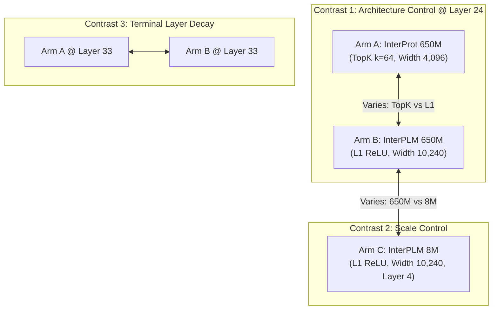

# Research Report: Optimal Data Subsets and Feature Space for PTM SAE Interpretability

**Document Scope**: Rigorous specification of target sequence corpora, chemical strata, PTM label subsets, negative populations, and SAE dictionary features for the thesis.
**Primary Sources**:
- `proposal/PTM_Interpretability_Implementation_Plan_V3.md` (Design Invariants, Part 0 & Phase I–III)
- Primary Literature: SPIRAL (*Nature Methods* 2024), InterPLM (ICLR 2025), InterProt (NeurIPS 2024), ProtSAE (AAAI 2026), COMPASS-PTM (*Nat. Commun.* 2026)
- Harmonized Reference Data: `data/processed/split_manifest.json`, `data/processed/ptm_sites.jsonl`

---

## 1. Executive Summary & Core Decisions

The central thesis investigates: **Do pretrained protein language models (ESM-2) emergently discover post-translational modification (PTM) concepts in their unsupervised representations, and can sparse autoencoders (SAEs) disentangle them?**

To answer this without confounding sequence composition or homology leakage, the thesis uses:
1. **Sequence Corpus**: Reviewed Swiss-Prot Human Proteome (18,129 proteins <= 1022 AA), partitioned 80/20 into discovery/held-out with strict 50% homology cluster isolation.
2. **Residue-Stratified Backgrounds**: Evaluating latents strictly within target amino acid strata (`K`, `ST`, `N`, `Y`) to eliminate the 17x amino-acid identity confound.
3. **Headline PTM Subset**: 10 high-confidence PTM types clearing the >=1,000 site statistical power bar, spanning acylation, ubiquitination, phosphorylation, and glycosylation.
4. **Target Feature Space**: Depth-matched anchor layers (**Layer 24** for 650M; **Layer 4** for 8M) across three controlled contrast arms (TopK vs L1 ReLU; 650M vs 8M scale).

---

## 2. Sequence Corpus & Homology Partitioning

### A. Inclusion Criteria
* **Taxonomy**: *Homo sapiens* (Taxonomy ID 9606).
* **Curation**: UniProtKB/Swiss-Prot **reviewed canonical only** (isoforms and unreviewed TrEMBL entries excluded to eliminate coordinate drift).
* **Length Filter**: Sequence length $L \le 1022$ amino acids (hard context ceiling for ESM-2 and both SAE families).
* **Corpus Size**: **18,129 proteins** (~7.47 million amino acid tokens).

### B. Three-Way Partition Hierarchy (MILP Homology-Isolated)
To facilitate rigorous unsupervised SAE architecture exploration and hyperparameter ablations without contaminating the final benchmark, the 50% identity clusters are organized into a 3-way hierarchy:
* **Discovery Train (~70%)**: **8,894 proteins** (5,078,574 tokens, 67.95%).
  - *Role*: Unsupervised dictionary training for Modular SAE variants (TopK vs L1, width sweeps, auxiliary sequence conditioning).
* **Discovery Val (~10%)**: **3,240 proteins** (726,717 tokens, 9.72%).
  - *Role*: SAE validation, sparsity vs reconstruction Pareto frontier calibration, and hyperparameter selection.
* **Held-Out Test (~20%)**: **5,995 proteins** (1,669,156 tokens, 22.33%).
  - *Role*: Unbiased hypothesis confirmation, out-of-distribution validation, and cross-species verification.
  - *Homology Boundary*: CD-HIT 50% sequence identity clusters assigned as indivisible atomic blocks. Zero homologous clusters span the discovery/held-out boundary.

---

## 3. Chemical Residue Strata (The Methodological Core)

### The 17x Identity Confound
Every succinylation or ubiquitination site is a Lysine (`K`). In ESM-2, amino-acid identity latents fire on nearly all instances of a given residue.
With **all residues** as background:
$$\text{Fold Enrichment (FE)} = \frac{P(\text{fires} \mid \text{succinylated})}{P(\text{fires})} = \frac{1.00}{0.058} \approx 17.2\times$$
A trivial lysine detector scores a 17-fold enrichment with an astronomically significant p-value ($p < 10^{-50}$), falsely topping the leaderboard.

### The Residue-Stratified Solution
Evaluating latents strictly against **unmodified target residues of the same chemical stratum**:
$$\text{FE}_{\text{stratified}} = \frac{P(\text{fires} \mid \text{modified Lysine})}{P(\text{fires} \mid \text{any Lysine})} = \frac{1.00}{1.00} = 1.00$$
The confound is eliminated arithmetically.

| Stratum | Target Amino Acids | Reference Residue Count | Primary PTM Types Tested |
| :--- | :--- | :---: | :--- |
| **Lysine (`K`)** | Lysine (K) | ~120,800 validated sites | Ubiquitination, Acetylation, Sumoylation, Succinylation, Malonylation, Crotonylation |
| **Ser/Thr (`ST`)** | Serine (S), Threonine (T) | ~25,200 validated sites | Phosphorylation, O-GlcNAcylation, O-Glycosylation |
| **Asparagine (`N`)** | Asparagine (N) | ~10,800 validated sites | N-Glycosylation (sequon context $N-X-[S/T]$) |
| **Tyrosine (`Y`)** | Tyrosine (Y) | ~1,750 validated sites | Tyrosine Phosphorylation, Nitration |

---

## 4. PTM Label Subset & Minimum Frequency Tiers

To satisfy statistical power at Bonferroni-corrected threshold (testing $m \approx 10^5$ latent-PTM pairs at family-wise error $\alpha = 0.05 \implies \alpha_{\text{adj}} \approx 5 \times 10^{-7}$), modifications are stratified into frequency tiers:

### Tier 1: Headline-Eligible PTM Types ($N_{\text{sites}} \ge 1,000$)
These 10 types possess sufficient statistical power to detect a true fold-enrichment $\text{FE} \ge 2.0$:

| PTM Type | Chemical Stratum | Validated Human Sites in Corpus | Biological Significance |
| :--- | :---: | :---: | :--- |
| **Ubiquitination** | Lysine (`K`) | **87,327** | Proteasomal degradation, signaling |
| **Acetylation** | Lysine (`K`) | **38,936** | Chromatin remodeling, metabolic regulation |
| **Sumoylation** | Lysine (`K`) | **30,853** | Nuclear transport, transcriptional stress |
| **Phosphorylation** | Ser/Thr/Tyr (`ST`, `Y`) | **26,071** | Kinase cascades, signal transduction |
| **N-Glycosylation** | Asparagine (`N`) | **10,780** | Secretory pathway, protein folding |
| **Crotonylation** | Lysine (`K`) | **9,502** | Epigenetic transcriptional activation |
| **2-Hydroxyisobutyrylation** | Lysine (`K`) | **7,148** | Metabolic and histone regulation |
| **Succinylation** | Lysine (`K`) | **4,295** | Mitochondrial metabolism, sirtuin targets |
| **Methylation** | Lysine (`K`), Arg (`R`) | **3,942** | Epigenetics, RNA-binding complexes |
| **Malonylation** | Lysine (`K`) | **3,721** | Fatty acid synthesis, metabolic stress |

### Tier 2: Secondary Types ($200 \le N_{\text{sites}} < 1,000$)
Evaluated in dedicated statistical tests but reported as secondary exploratory findings (e.g. Glutarylation, Citrullination).

### Tier 3: Rare Pooled Types ($N_{\text{sites}} < 200$)
Relabelled into `"Other PTM"` within their chemical stratum. They are **never deleted** because treating a modified residue as an unmodified negative injects false negatives.

### Multi-Label Crosstalk Sites
* **42,650 sites (26.8% of all sites)** carry $>1$ modification type (e.g. Lysine residues subject to both Ubiquitination and Acetylation).
* **Analytical Purpose**: Proves whether a latent is **type-specific** (firing only on ubiquitinated lysines) or merely a **permissive accessibility / disorder detector** (firing whenever a lysine is exposed).

---

## 5. Negative Population Construction

Evaluating latent enrichment requires precisely defining the negative denominator:

| Negative Tier | Definition | Use Case |
| :--- | :--- | :--- |
| **Hard Negatives (Corpus A - Primary)** | Unannotated target residues in proteins known to carry that PTM type. | Guarantees the protein was experimentally investigated for that PTM, minimizing unannotated false negatives. |
| **Background Negatives (Corpus B - Sensitivity)** | All target residues in the entire proteome. | Assesses sensitivity to proteome-wide unstudied protein contamination. |
| **Gold Negatives** | Experimentally verified unmodified residues. | Available for N-Glycosylation (N-GlyDE verified non-glycosylated sequons). |

---

## 6. Target Model & Feature Space (SAE Latents)

The thesis evaluates **21 layer-checkpoint combinations** organized into three controlled contrasts:

### Depth-Matched Anchor Layers
* **ESM-2 650M (Arms A & B)**:
  - **Layer 24 of 33** (Relative depth **0.73**): Primary functional representation depth. Mid-to-late transformer layers exhibit peak structural and biochemical concept concentration.
  - **Layer 33 of 33** (Terminal layer): Tests the known late-layer representational collapse/task-head specialization.
* **ESM-2 8M (Arm C)**:
  - **Layer 4 of 6** (Relative depth **0.73**): Exactly depth-matched to Layer 24 ($0.73 \times 6 \approx 4.38$). Independently established as ESM-2 8M's structurally strongest layer.
  - **Layer 6 of 6** (Terminal layer): Terminal comparison.

---

## 7. Recommended Execution Order for Deliverables

1. **Phase 1 (Data & Stratified Baselines)**: 
   - Compute contingency tables on the 10 headline PTM types on **Arm A @ Layer 24**.
   - Emits **Table T2** (Dataset Composition) and **Figure F4** (Stratified vs. Naive Enrichment — the headline methodological proof).
2. **Phase 2 (Architecture Contrast)**:
   - Run identical screening on **Arm B @ Layer 24** to establish TopK vs. L1 ReLU fidelity.
3. **Phase 3 (Out-of-Distribution Validation)**:
   - Evaluate top candidate latents on the 20% `held_out` partition (<50% homology).
   - Emits generalization metrics and proves absence of sequence memorization.
