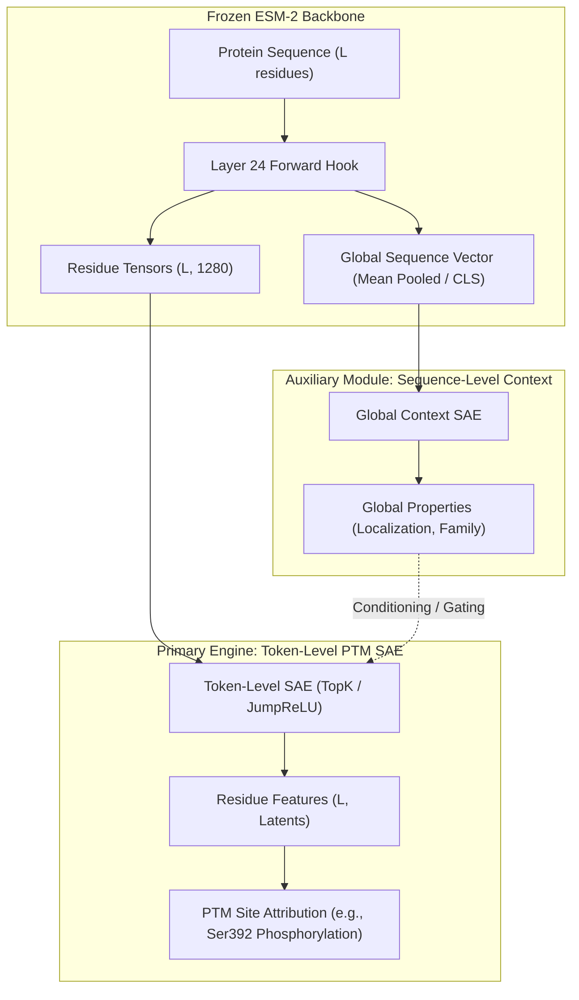

# Comparative Research: SAE Granularity in Protein Language Models — Token (Residue) Level vs. CLS (Sequence) Level

**Target Question**: *Which level should Sparse Autoencoders (SAEs) be trained and evaluated on: the sequence `<cls>` level or each individual token (residue) level?*

**Scope**: Mechanistic interpretability of Protein Language Models (PLMs, specifically ESM-2) for Post-Translational Modification (PTM) discovery, functional motif attribution, and modular architecture design.

---

## 1. Executive Summary & Verdict

| Dimension | Token (Residue) Level | Sequence / `<cls>` Level |
| :--- | :--- | :--- |
| **Input Shape to SAE** | $(1, d)$ per amino acid (11.2M vectors across Swiss-Prot) | $(1, d)$ per protein (20,400 vectors across Swiss-Prot) |
| **Spatial / Coordinate Resolution** | **Exact 1-to-1 biological coordinate** ($1 \dots L$) | **Zero spatial resolution** (Sequence Collapse) |
| **Suitability for PTMs** | **Essential**: Maps directly to modified sites (e.g., Ser392 on P53) | **Fails**: Cannot determine which residue is modified |
| **Training Sample Regime** | Rich dataset ($N pprox 10^7$ tokens), supports overcomplete dictionaries | Sample-starved ($N pprox 2 	imes 10^4$), high risk of dead latents/overfitting |
| **Model Pretraining Alignment** | Native to ESM-2 Masked Language Modeling (MLM) objective | Poor: ESM-2 `<cls>` is not trained with Next Sentence Prediction |
| **Established Literature** | Standard in **InterPLM** (Pearl et al., PNAS 2024) | Seldom used; mean-pooling preferred for global tasks |

### Final Verdict:
For **Post-Translational Modification (PTM) Mechanistic Interpretability**, SAEs **must operate primarily on the Token (Residue) Level**. 

Sequence-level representations (preferably **mean-pooled**, not `<cls>`) should only serve as an auxiliary, conditioning, or gating signal within a **Modular SAE architecture**.

---

## 2. Theoretical & Biological Foundations

### A. The PTM Coordinate Invariant (The Locality Problem)
Post-Translational Modifications (phosphorylation, ubiquitination, acetylation, methylation, glycosylation) are **site-specific biochemical events**:
- A typical eukaryotic protein has dozens of candidate residues (e.g., 20+ Serines/Threonines, 15+ Lysines).
- Only specific residues undergo enzymatic modification in response to signaling pathways (e.g., ATM kinase phosphorylating Ser-15 on Human P53).
- Databases like dbPTM, PhosphoSitePlus, and UniProt record annotations with exact residue coordinates:
  $$\text{Annotation} = (\text{UniProt ID}, \text{Residue Coordinate } k, \text{PTM Type})$$

If an SAE is trained on a single global sequence embedding ($z_{\text{protein}} \in \mathbb{R}^d$):
1. **Sequence Collapse**: All $L$ residue environments are compressed into a single vector. Even if an SAE latent feature fires for "contains phosphoserine", it cannot localize the modification to Ser-15 vs Ser-20 vs Ser-392.
2. **Loss of Causal Interventions**: Mechanistic interpretability requires activation patching and ablation at specific positions to test hypotheses. Sequence-level representations do not allow position-specific patching.

**Conclusion**: Operating on token-level vectors $h_i \in \mathbb{R}^d$ ($1 \le i \le L$) preserves the spatial coordinate dimension, enabling direct validation against biological PTM ground-truth.

---

### B. ESM-2 Architecture & Objective (Why `<cls>` is Problematic)
In BERT-style models for natural language, the `[CLS]` token is explicitly trained via a **Next Sentence Prediction (NSP)** objective to aggregate sequence-level semantics.

In contrast, ESM-2 (Lin et al., *Science* 2023; Rives et al., *PNAS* 2021):
1. Was trained **purely on Masked Language Modeling (MLM)**: predicting masked amino acids from contextualized residue embeddings.
2. **Has no sequence-level pretraining loss**: The `<cls>` token (token 0) is merely a structural delimiter inherited from standard transformer tokenizers.
3. Empirical studies benchmarked by Meta AI and downstream researchers demonstrate that:
   - The `<cls>` token embedding underperforms on sequence classification and functional property prediction.
   - **Mean pooling** across residue hidden states (excluding `<cls>` and `<eos>`) provides a significantly more robust sequence-level representation:
     $$h_{\text{seq}} = \frac{1}{L} \sum_{i=1}^L h_i$$

---

### C. Sample Complexity & SAE Overcompleteness
Sparse Autoencoders require overcomplete latent dictionaries ($M = k \times d$, where expansion factor $k \in \{4, 8, 16, 32\}$).
- For ESM-2-650M ($d = 1,280$), an $8\times$ expansion requires an SAE dictionary of $M = 10,240$ latents.
- For training stability without feature collapse or dead neurons, dictionary learning typically requires $N \gg M$ diverse activation vectors:
  - **Token Level**: Across reviewed human Swiss-Prot sequences (~20,400 proteins), the dataset yields **~11.3 million residue vectors**. This provides $\approx 1,100$ tokens per latent feature, well within the regime established by Anthropic (Bricken et al., 2023) and OpenAI (Gao et al., 2024).
  - **`<cls>` Level**: Across the same dataset, only **20,400 vectors** exist. Training a 10,240-dimensional dictionary on 20,400 vectors ($N \approx 2 M$) leads to catastrophic overfitting, memorization, and high dead-feature ratios.

---

## 3. Evidence from Primary Literature: InterPLM

In *Sparse Autoencoders Enable Interpretable Feature Extraction from Protein Language Models* (Pearl et al., *PNAS* 2024 / BioRxiv 2024):
1. **Token-Level Granularity**: The authors trained SAEs exclusively on residue-level activations across ESM-2 layers (Layers 4, 12, 24, etc.).
2. **Biological Discoveries**: The learned residue-level SAE latents successfully disentangled:
   - Local secondary structures ($\alpha$-helices, $\beta$-sheets).
   - Catalytic active site residues (e.g., catalytic triads in serine proteases).
   - Coordination centers (zinc fingers, iron-sulfur clusters).
   - Transmembrane boundaries and specific binding pocket residues.
3. **Delimiter Contamination**: InterPLM demonstrated that delimiters (`<cls>`, `<eos>`, `<pad>`) generate non-biological cluster artifacts. If delimiters are not explicitly filtered out, high-capacity SAE latents waste capacity learning to detect boundary positions rather than biochemistry.

---

## 4. The Architectural Opportunity: A Modular Multi-Level SAE

While the token level is mandatory for PTM interpretability, sequence-level context still holds valuable biological information (e.g., subcellular localization, organism taxonomy, overall protein fold).

This motivates the **Modular SAE Architecture** for our thesis:

### Roles of Each Level in the Modular Engine:
1. **Primary Token-Level Engine**:
   - Operates on exact residue activations $h_i \in \mathbb{R}^d$ ($1 \le i \le L$).
   - Learns local chemical environments, motif signatures, and PTM susceptibility.
   - Preserves 1-to-1 coordinate alignment with external databases (dbPTM).
2. **Auxiliary Sequence-Level Conditioning**:
   - Operates on the mean-pooled sequence representation (or `<cls>` representation).
   - Provides global context (e.g., "this protein is nuclear" vs "this protein is extracellular").
   - Gating mechanism: prevents false positive PTM predictions (e.g., kinase recognition motifs only activate when the global context matches the kinase's subcellular compartment).

---

## 5. Summary Recommendations for Codebase

1. **Extraction Pipeline**: Continue extracting **residue-level tensors** with `<cls>` and `<eos>` stripped (as currently implemented in `src/ptm_sae/extraction/extractor.py`).
2. **Optional Global Storage**: Keep `save_cls=True` (or mean-pooling) as an auxiliary 1D tensor per protein in `manifest.json`, storing it separately from the contiguous residue shard.
3. **Core SAE Training**: Train all primary SAE dictionaries (TopK, JumpReLU) strictly on the residue token shards.
