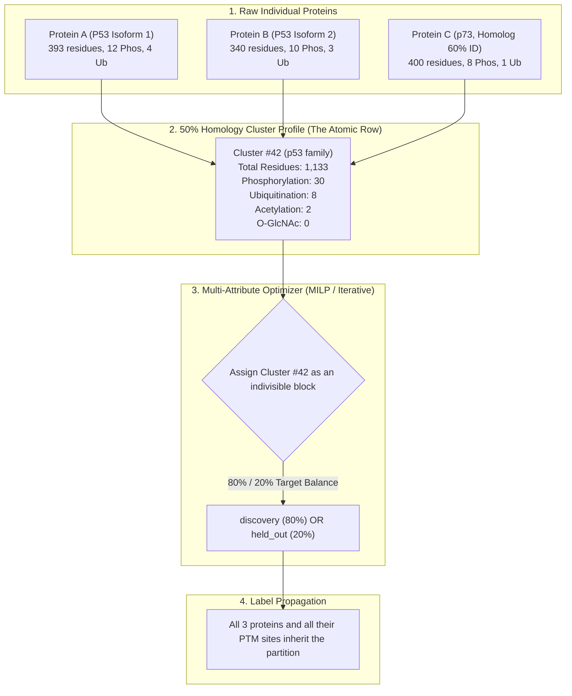

Here is the exact step-by-step mechanism of how **attribute splitting works on top of sequence clustering**:

---

### The Fundamental Rule: The Cluster is the Atomic Row

You **never split individual proteins**. Instead, you aggregate all protein attributes up to the **cluster level** first.

Think of it as turning a table of ~20,400 individual proteins into a table of **~12,000 clusters**, where each cluster has a summary profile of all its member proteins:

---

### Step-by-Step Breakdown

#### Step 1: Cluster-Level Attribute Aggregation
For each cluster $i$, compute the sum of all its member proteins:
1. **Total Residues / Tokens ($T_i$)**: The sum of sequence lengths ($\sum L_p$).
2. **PTM Counts Vector ($Y_{i}$)**: Sum of each modification type across all members in the cluster:
   $$\text{Cluster Profile} = \Big[ \text{Phos}: 30, \; \text{Ub}: 8, \; \text{Acetyl}: 2, \; \text{O-GlcNAc}: 0, \; \dots \Big]$$
3. **Stratum Totals**: Total counts of candidate amino acids (e.g., $N_{\text{Lysines}} = 48$, $N_{\text{Ser/Thr}} = 120$).

---

#### Step 2: Establish Target Quotas
Suppose your target is an **80% `discovery` / 20% `held_out`** split. 

You calculate the target sums for the 20% `held_out` partition across the entire proteome:

| Attribute | Total in Entire Proteome | Target for `held_out` (20%) |
| :--- | :---: | :---: |
| **Total Residue Tokens** | 10,000,000 | **2,000,000** |
| **Phosphorylation Sites** | 240,000 | **48,000** |
| **Ubiquitination Sites** | 60,000 | **12,000** |
| **Acetylation Sites** | 20,000 | **4,000** |
| **O-GlcNAc Sites** *(Rare)* | 800 | **160** |

---

#### Step 3: The Optimization Step (Solving for Binary Decision $x_i$)

Every cluster $i$ is assigned a single binary variable:
$$x_i \in \{0, 1\} \quad \text{where } x_i = 1 \text{ (held\_out)} \text{ and } x_i = 0 \text{ (discovery)}$$

The solver (SciPy MILP or Greedy Iterative Stratification) finds the assignment of $\{x_i\}$ that minimizes the difference between the **actual total** and the **target quota** across all attributes simultaneously:

$$\text{Minimize} \sum_{\text{PTM } c} w_c \cdot \left| \sum_{i=1}^{N_{\text{clusters}}} x_i Y_{i, c} - \text{Target}_c \right| + w_{\text{tokens}} \cdot \left| \sum_{i=1}^{N_{\text{clusters}}} x_i T_i - \text{Target}_{\text{tokens}} \right|$$

**How the solver handles rare vs frequent attributes**:
1. It assigns clusters carrying **rare PTMs** (like O-GlcNAc with only 160 target sites) first, steering those clusters into `discovery` or `held_out` to hit the 160 mark exactly.
2. It then uses the thousands of clusters containing **frequent PTMs** (like Phosphorylation) to fill the remaining volume without disturbing the rare PTM balance.
3. It balances total sequence length so the total tokens in `held_out` land right on 20% ($\pm 1\%$).

---

#### Step 4: Downward Label Propagation
Once the solver decides $x_{42} = 0$ (meaning Cluster #42 is assigned to `discovery`):
* `Protein A`, `Protein B`, and `Protein C` are all tagged with `partition: "discovery"`.
* Every PTM site on those proteins is tagged with `partition: "discovery"`.
* **Zero Homology Leakage**: None of these proteins or their homologs will ever appear in the `held_out` test set.
* **Balanced Evaluation**: The `held_out` test set is guaranteed to have exactly 20% of all Phosphorylations, 20% of all Ubiquitinations, and 20% of all O-GlcNAcylations.

---

### Concrete Numerical Example

Imagine we only have 4 clusters and 2 PTM types (Phospho & O-GlcNAc), targeting a 50/50 split:

| Cluster ID | Proteins in Cluster | Total Tokens | Phospho Sites | O-GlcNAc Sites | Solver Decision ($x_i$) |
| :---: | :--- | :---: | :---: | :---: | :---: |
| **Cluster 1** | Kinases (CDK1, CDK2) | 1,200 | 25 | 0 | $\to$ **`discovery`** |
| **Cluster 2** | Kinases (MAPK1, MAPK3) | 1,150 | 23 | 0 | $\to$ **`held_out`** |
| **Cluster 3** | Nuclear Factor (NF-κB family) | 800 | 5 | 10 | $\to$ **`discovery`** |
| **Cluster 4** | Transcription Factor (SP1 family) | 850 | 7 | 10 | $\to$ **`held_out`** |
| **Total Realized** | **`discovery` vs `held_out`** | **2,000 vs 2,000** | **30 vs 30** | **10 vs 10** | **Exact 50/50 Balance!** |

*Notice:* 
* Closely related homologs (CDK1 and CDK2) stayed together in `discovery`.
* MAP kinases stayed together in `held_out`.
* The rare modification (O-GlcNAc) and the frequent modification (Phospho) are both perfectly split 50/50!